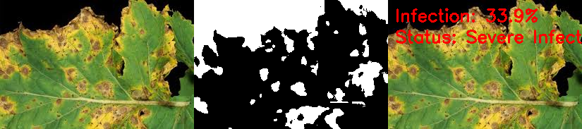

# 🌿 Plant Disease Detection System

### 📖 Project Overview
This project detects **plant leaf diseases** using **image processing and basic machine learning concepts**.  
It analyzes images of plant leaves and identifies the level of infection based on color and texture segmentation.

### 🧠 Key ML Concepts Used
- **Image Segmentation** – separating diseased and healthy leaf regions.  
- **Feature Extraction** – analyzing color and shape features of lesions.  
- **Threshold-based Classification** – categorizing infection as *Healthy*, *Mild*, *Moderate*, or *Severe*.  
- **Automation Logic** – mapping infection levels to spray actions.

### 🛠️ Technologies Used
- Python 🐍  
- OpenCV (image processing)  
- NumPy  
- MQTT (for IoT-based communication simulation)

### 🖼️ Example Output
After processing a leaf image:



Detected Infection: **38.11% – Severe Infection**

### 🚀 How to Run
1. Install dependencies:
   ```bash
   pip install opencv-python numpy paho-mqtt
